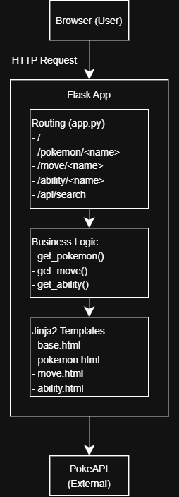
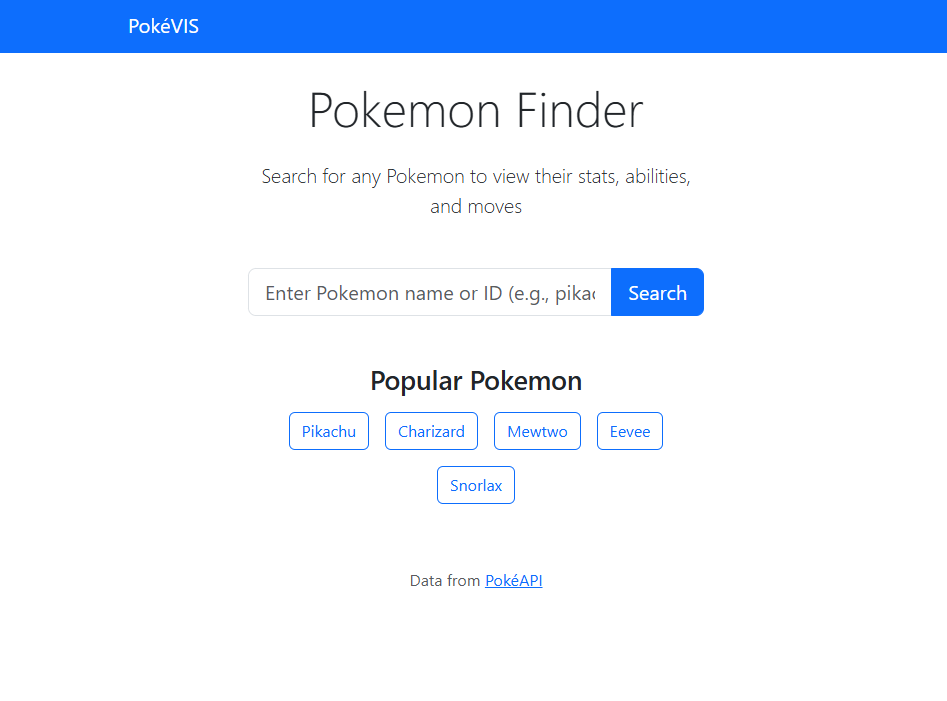
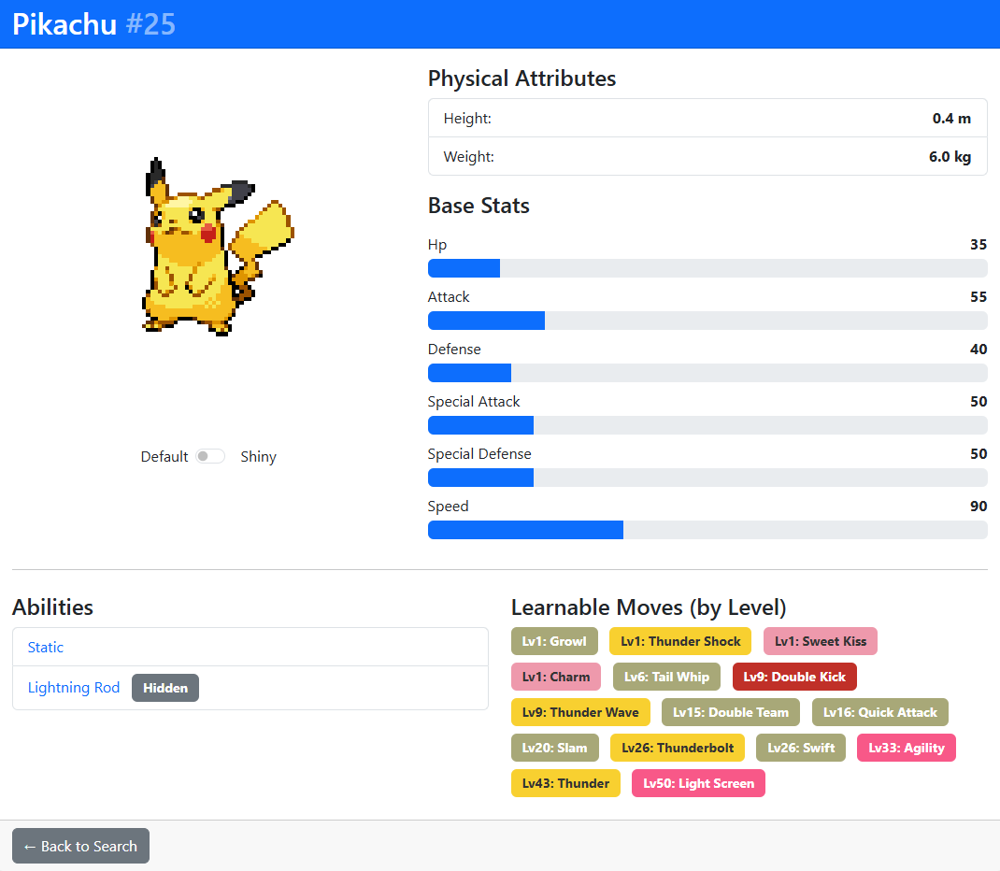
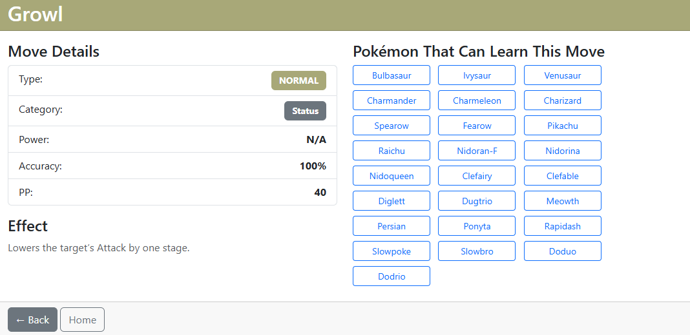
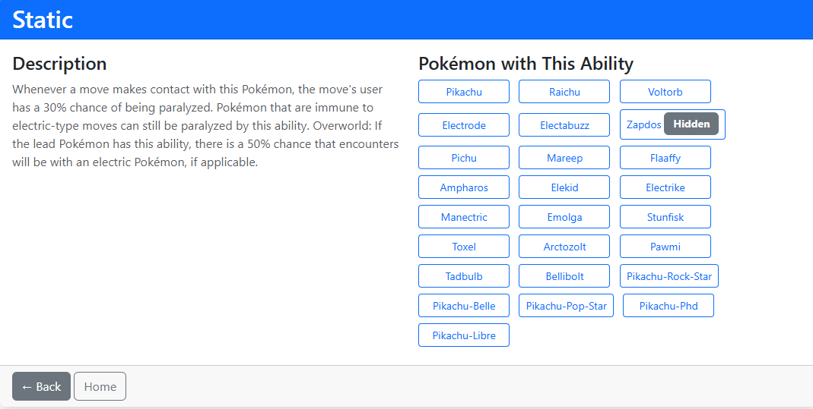

# pokeVIS - A Pokemon Search and Visualization App

## 1) Executive Summary

**Problem:** Growing up I was a huge fan of Pokemon, constantly playing the new releases or, on occasion, buying pokemon cards. However, whilst playing pokemon games, I did not always know what pokemon I was up against. This becomes especially important when it comes to stats and types.

**Solution:** pokeVIS fixes this problem. It is a web-based information search system that gives useful information on any pokemon. Either by the Pokemon's name or ID, users can see what type, stats, abilities, and learnable moves for the Pokemon they search for in pokeVIS. The website it made to be easy to understand, with types for moves being badges with their respective type coloring, or a simple layout to understand how much HP (hit points/health) or SP (special defense) a pokemon has. The build itself pulls from the free and updating PokeAPI, making it easy to deploy and lightweight in general due to the lack of a database.

## 2) System Overview

**Course Concept(s):**
- **Flask Web Framework**: routing, RESTful API development, templating with Jinja2
- **Docker Containerization**: Application packaging and deployment
- **API Integration**: Using external APIs (PokeAPI)

**Architecture Diagram:**  
<div align="center">
  
</div>

**Data/Models/Services:**

| Component | Source | Size/Format | License |
|-----------|--------|-------------|---------|
| Pokemon Data | [PokeAPI v2](https://pokeapi.co) | JSON REST API | BSD License |
| Frontend Framework | Bootstrap 5.3.0 | CDN | MIT License |
| Icons/Sprites | PokeAPI Sprites | PNG images | Fair Use |
| Application | Custom Flask App | ~500 lines Python | MIT License |

## 3) How to Run (Local)

### Option A: Docker

```bash
# Build the image
docker build -t pokevis:latest .

# Run the container
docker run --rm -p 5000:5000 pokevis:latest

# Access the app
# Open browser: http://localhost:5000
```

### Option B: Python Direct

```bash
# Install dependencies
pip install -r requirements.txt

# Run the app
cd src
python app.py

# Access the app
# Open browser: http://localhost:5000
```

### Health Check

```bash
# Verify app is running
curl http://localhost:5000

# Test API endpoint
curl http://localhost:5000/api/search?q=pika
```

### Run Tests

```bash
# Run smoke tests
python tests/test_smoke.py

# Or with pytest
pytest tests/test_smoke.py -v
```

## 4) Design Decisions

### Why this concept?
- I chose Flask due to its simplicity and my familiarity.
- **Alternatives Considered:**
    - MongoDB/SQL: I wanted this app to be light weight and easy to deploy, however in the future I may implement a cache system to reduce the API request load.
    - vLLM serving: I really wanted to do something with this but did not have a clear picture of what I wanted to create. It seems complex but I think I will implement it in a project in the future.

### Tradeoffs:
- **Performance:** Since I am pulling directly from the API, load times are slower and there are more requests sent to the API. However, the website still operates pretty quickly with a low amount of users.
- **Cost:** For cloud hosting, I decide to use render which has a free tier I can use and host a website with my app deployed.
- **Complexity:** Flask is very reasonable and understandable but for me a large amount of complexity came from learning how to use Bootstrap to format the elements and overall make the website look palatable. 
- **Maintainability:** Since PokeAPI is constantly updated, the website updates itself. As long as the render website stays afloat, there shouldn't be any other maintenance issues unless there are some bugs.

### Security/Privacy:
- **Secrets Management:** No API keys as PokeAPI is public and free to use
- **Input Validation:** 
  - Flask has built-in escaping to clean up user inputs
  - All Pokemon identifiers are first validated before API calls
- **PII Handling:** No user data collected or stored

### Operations
- **Logging:** Flask debug logs to stdout
- **Metrics:** None
- **Scaling:** Horizontal scaling Available
- **Known Limitations:**
  - Rate limits: PokeAPI has fair use policy
  - No offline mode
  - No authentication/user accounts to save favorite pokemon or pokemon teams
  - Website can only handle so much traffic

## 5) Results & Evaluation

### Screenshots

**Homepage - Search Interface:**

- Clean search bar with autocomplete
- Popular Pokemon quick links

**Pokemon Detail Page:**

- Sprite display with shiny toggle
- Type badges with accurate colors
- Base stats with progress bars
- Moves organized by level learned

**Move Information Page:**

- Type and damage class indicators
- Power, accuracy, PP stats
- Pokemon that can learn the move

**Ability Information Page:**

- Description
- Pokemon with that ability (marks whether hidden or not)


### Performance

Runs quickly although could run faster with caching. The main issue is the amount of API requests which I will address in the future.

### Validation & Tests

**Smoke Tests (7 tests):**
- ✅ App Starts
- ✅ Homepage loads
- ✅ Pokemon detail page (Pikachu)
- ✅ 404 error handling
- ✅ Search API endpoint
- ✅ Move detail page
- ✅ Ability detail page
- ✅ Health Endpoint

**Manual Testing:**
- ✅ Tested with 25+ different Pokemon
- ✅ Shiny toggle works correctly
- ✅ Type colors display accurately
- ✅ Mobile responsive (tested on iPhone/Android)
- ✅ Autocomplete search (tested with partial names)

## 6) What's Next

### Planned Improvements
1. **Caching Layer:** Implement Redis for frequently accessed Pokemon
2. **Type Effectiveness Chart:** Interactive type matchup calculator
3. **Evolution Chain Visualization:** Add D3.js tree diagram showing evolution paths
4. **Compare Feature:** Side-by-side Pokemon comparison with radar charts
5. **User, Team, and Favorites System:** Add user account creation, Pokemon team creation (maybe with an AI grader), and adding pokemon to favorites

## 7) Links

- **GitHub Repo:** [https://github.com/mqngow/pokeVIS](https://github.com/mqngow/pokeVIS)
- **Public Cloud App:** [https://pokevis.onrender.com](https://pokevis.onrender.com)
- **PokeAPI Documentation:** [https://pokeapi.co/docs/v2](https://pokeapi.co/docs/v2)

## External Code Used:
- Bootstrap CSS/JS framework (CDN, MIT License)
- jQuery library (CDN, MIT License)
- Python Flask framework (BSD License)
- GitHub Copilot Autocomplete when writing HTML
